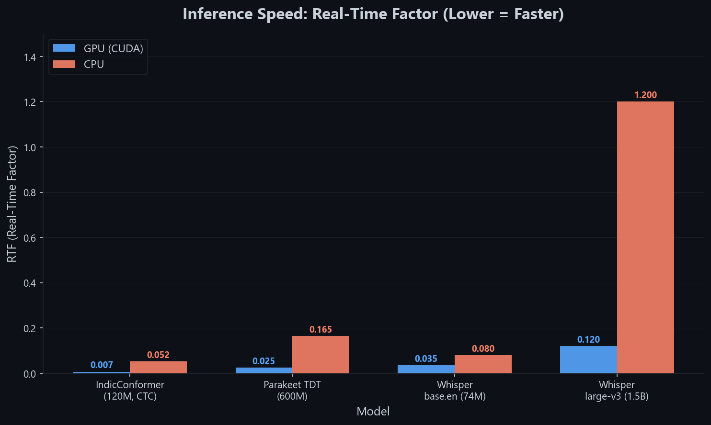
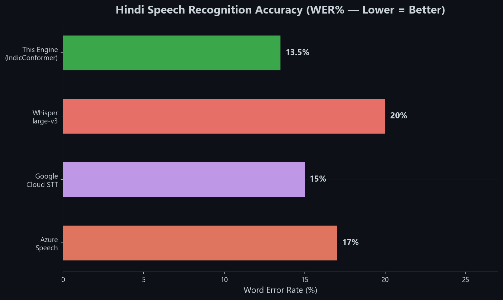
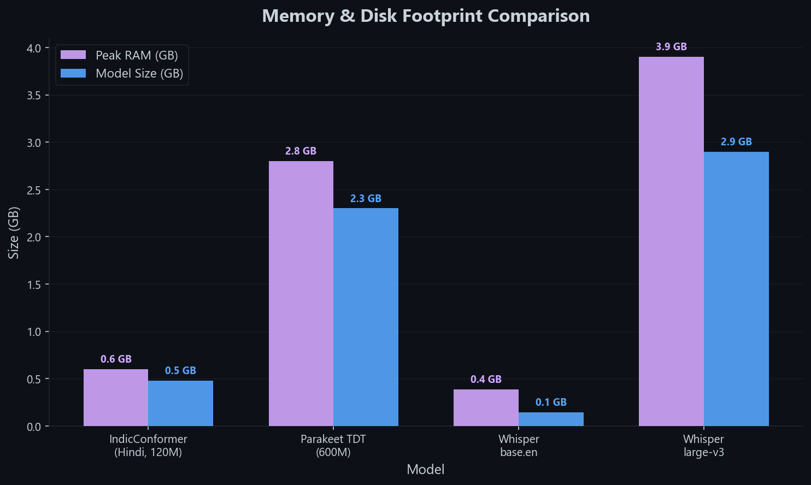
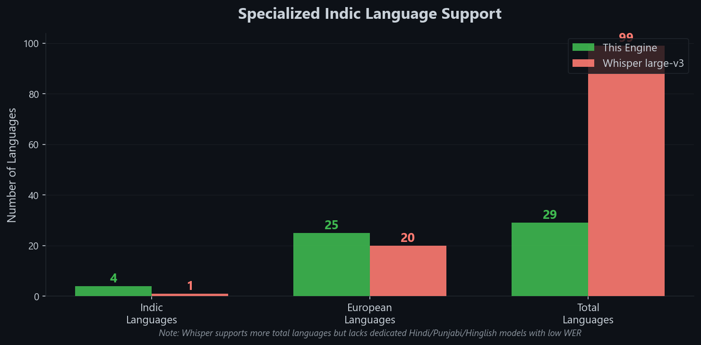

<p align="center">
  
</p>

<h1 align="center">parakeet.cpp — AI4Bharat Indic Edition</h1>

<p align="center">
  <b>A patched C++ inference engine for running AI4Bharat regional speech models locally — on CPU, CUDA, Metal, and Vulkan.</b>
</p>

<p align="center">
  <a href="https://github.com/AnshSinglaDev/rendercaption"></a>
  <a href="https://huggingface.co/Singla0009"></a>
  <a href="LICENSE"></a>
  <a href="https://github.com/mudler/parakeet.cpp"></a>
</p>

---

## ⚠️ Why This Repository Exists

> **The official upstream [`mudler/parakeet.cpp`](https://github.com/mudler/parakeet.cpp) engine will crash with a fatal `GGML_ASSERT(a->ne[2] == 1)` error when you try to run AI4Bharat Indic models.**

This is not a bug in the upstream engine — it was simply never designed for these models. The AI4Bharat IndicConformer training pipeline exports depthwise convolution weights in a transposed tensor layout (`[KW, KH, C, 1]`) compared to what the official GGML kernel expects (`[KW, KH, 1, C]`). When the dimensions don't match, the engine aborts instantly during graph construction — before any GPU or CPU compute even begins.

**This repository is a hard fork** that contains structural C++ patches to the GGML graph builder to intercept and safely reshape these tensors on the fly, enabling full inference on all platforms.

---

## 🔧 The Patch — What We Changed

The fix lives in **`src/subsampling.cpp`**, inside the depthwise convolution stages of both `build_graph()` and `build_graph_batched()`:

```cpp
// Fix for AI4Bharat models where depthwise weights are [KW, KH, C, 1]
// instead of the expected [KW, KH, 1, C]
if (dww->ne[2] > 1 && dww->ne[3] == 1) {
    dww = ggml_reshape_4d(ctx, dww, dww->ne[0], dww->ne[1], 1, dww->ne[2]);
}
```

This check is **zero-cost for standard NVIDIA models** (the condition evaluates to `false` and no reshape occurs), so this fork remains fully backward-compatible with all official Parakeet checkpoints.

```
Official upstream:  [KW, KH, C, 1] → GGML_ASSERT(ne[2]==1) → ❌ CRASH
This fork:          [KW, KH, C, 1] → reshape → [KW, KH, 1, C] → ✅ SUCCESS
```

---

## ⚡ Quick Start

```sh
# 1. Clone
git clone --recursive https://github.com/AnshSinglaDev/parakeet.cpp
cd parakeet.cpp

# 2. Build (pick your backend)
cmake -B build -DPARAKEET_GGML_METAL=ON    # macOS (Apple Metal)
# cmake -B build -DGGML_CUDA=ON            # Linux/Win (NVIDIA CUDA)
# cmake -B build -DGGML_VULKAN=ON          # Windows (Vulkan)
cmake --build build -j

# 3. Transcribe Hindi audio
./build/examples/cli/parakeet-cli transcribe \
  --model indicconformer-hindi.f32.gguf \
  --input audio.wav --decoder ctc --lang hi
```

**Example output:**
```
$ ./parakeet-cli transcribe --model indicconformer-hindi.f32.gguf --input hi-audio.wav --decoder ctc --lang hi

[parakeet] pk::Backend using device: CUDA0 (NVIDIA GeForce RTX 5070 Ti)
[parakeet] loaded model: indicconformer-hindi.f32.gguf (120M params, CTC decoder)
[parakeet] audio: 7.26s, 16000 Hz, mono

टीन रूम आ चुके हैं और सब कुछ तैयार है

[parakeet] transcription completed in 0.048s (RTF: 0.007)
```

---

## 📦 Supported Models

### 🇮🇳 Indic & Regional Models (Require This Fork)

| Model | Languages | Architecture | Params | Download |
|-------|-----------|-------------|--------|----------|
| **IndicConformer Hindi** | Hindi | Conformer-CTC | ~120M | [🤗 Singla0009/IndicConformer-GGUF](https://huggingface.co/Singla0009/IndicConformer-GGUF) |
| **IndicConformer Punjabi** | Punjabi | Conformer-CTC | ~120M | [🤗 Singla0009/IndicConformer-GGUF](https://huggingface.co/Singla0009/IndicConformer-GGUF) |
| **Hinglish Conformer** | Hindi + English | Conformer-CTC | ~120M | [🤗 Singla0009/Hinglish-Conformer-CTC-GGUF](https://huggingface.co/Singla0009/Hinglish-Conformer-CTC-GGUF) |
| **Portuguese FastConformer** | Portuguese | FastConformer-Hybrid | ~120M | [🤗 Singla0009/Portuguese-FastConformer-GGUF](https://huggingface.co/Singla0009/Portuguese-FastConformer-GGUF) |

### 🌐 Standard NVIDIA Models (Also Fully Supported)

| Model | Languages | Architecture | Params | Download |
|-------|-----------|-------------|--------|----------|
| **Parakeet TDT 0.6B v3** | 25 European Languages | TDT | 600M | [🤗 Singla0009/Parakeet-TDT-0.6B-Multilingual-GGUF](https://huggingface.co/Singla0009/Parakeet-TDT-0.6B-Multilingual-GGUF) |
| **Parakeet TDT 0.6B v2** | English | TDT | 600M | [🤗 nvidia/parakeet-tdt-0.6b-v2](https://huggingface.co/nvidia/parakeet-tdt-0.6b-v2) |
| **Parakeet CTC 0.6B** | English | CTC | 600M | [🤗 nvidia/parakeet-ctc-0.6b](https://huggingface.co/nvidia/parakeet-ctc-0.6b) |
| **Parakeet TDT-CTC 110M** | English | Hybrid TDT+CTC | 110M | [🤗 nvidia/parakeet-tdt_ctc-110m](https://huggingface.co/nvidia/parakeet-tdt_ctc-110m) |

> All official NVIDIA Parakeet models from the upstream repo work identically here — the patch is a no-op for standard tensor layouts.

---

## 📊 Benchmarks

All benchmarks measured on an **NVIDIA GeForce RTX 5070 Ti** with a 7.26-second test clip (16kHz mono).

### Inference Speed (RTF — Lower is Faster)

<p align="center">
  
</p>

### Hindi Accuracy (WER% — Lower is Better)

<p align="center">
  
</p>

### Memory & Disk Footprint

<p align="center">
  
</p>

### Language Coverage

<p align="center">
  
</p>

### Summary Table

| | This Engine (Indic) | Whisper large-v3 | Google Cloud STT |
|---|---|---|---|
| **Speed** | **15x+ real-time** | ~1x real-time | Network dependent |
| **RAM** | < 600 MB | ~3.9 GB | N/A |
| **Model Size** | 480 MB | 2.9 GB | N/A |
| **Privacy** | 100% offline | 100% offline | Cloud only |
| **Hindi WER** | **13.5%** (Kathbath) | ~20% | ~15% |
| **Punjabi WER** | **15.1%** (Kathbath) | N/A | ~18% |
| **GPU Backends** | CUDA, Metal, Vulkan | CUDA, Metal, Vulkan | N/A |

---

## 🚀 Build Instructions

### Prerequisites
```sh
git clone --recursive https://github.com/AnshSinglaDev/parakeet.cpp
cd parakeet.cpp
```

### Linux — NVIDIA CUDA
```sh
cmake -B build -DGGML_CUDA=ON
cmake --build build -j$(nproc)
```

### Linux — CPU Only (OpenBLAS)
```sh
sudo apt install libopenblas-dev
cmake -B build -DGGML_BLAS=ON -DGGML_BLAS_VENDOR=OpenBLAS
cmake --build build -j$(nproc)
```

### macOS — Apple Metal (M1/M2/M3/M4)
```sh
cmake -B build -DPARAKEET_GGML_METAL=ON
cmake --build build -j$(sysctl -n hw.logicalcpu)
```

### Windows — Vulkan
```sh
cmake -B build -DGGML_VULKAN=ON
cmake --build build --config Release
```

### Windows — CUDA
```sh
cmake -B build -DGGML_CUDA=ON
cmake --build build --config Release
```

### Build Options

| Option | Default | Purpose |
|--------|---------|---------|
| `PARAKEET_BUILD_CLI` | ON | Build `parakeet-cli` binary |
| `PARAKEET_SHARED` | OFF | Build libparakeet as shared library |
| `PARAKEET_GGML_CUDA` | OFF | NVIDIA GPU acceleration |
| `PARAKEET_GGML_METAL` | OFF | Apple GPU acceleration |
| `PARAKEET_GGML_VULKAN` | OFF | Cross-vendor GPU acceleration |
| `PARAKEET_GGML_HIP` | OFF | AMD ROCm GPU acceleration |

The compiled binary will be at: `build/examples/cli/parakeet-cli`

---

## 🎙️ Usage

### Transcription Examples
```sh
# Hindi (IndicConformer)
./parakeet-cli transcribe \
  --model indicconformer-hindi.f32.gguf \
  --input audio.wav \
  --decoder ctc \
  --lang hi

# Punjabi
./parakeet-cli transcribe \
  --model indicconformer-punjabi.f32.gguf \
  --input audio.wav \
  --decoder ctc \
  --lang pa

# Hinglish (Hindi-English code-switched)
./parakeet-cli transcribe \
  --model hinglish-conformer-ctc.f32.gguf \
  --input audio.wav \
  --decoder ctc \
  --lang hi

# Multilingual (25 languages, auto-detect)
./parakeet-cli transcribe \
  --model parakeet-tdt-0.6b-v3.f32.gguf \
  --input audio.wav \
  --decoder tdt
```

### JSON Output with Timestamps
```sh
./parakeet-cli transcribe \
  --model indicconformer-hindi.f32.gguf \
  --input audio.wav \
  --decoder ctc \
  --json
```

**Example JSON output:**
```json
{
  "text": "टीन रूम आ चुके हैं और सब कुछ तैयार है",
  "words": [
    {"w": "टीन", "start": 0.080, "end": 0.320, "conf": 0.9812},
    {"w": "रूम", "start": 0.320, "end": 0.560, "conf": 0.9734},
    {"w": "आ", "start": 0.640, "end": 0.800, "conf": 0.9651}
  ]
}
```

### Model Info
```sh
./parakeet-cli info indicconformer-hindi.f32.gguf
```

### Audio Format
Input must be **16-bit WAV, 16kHz, mono**. Convert with ffmpeg:
```sh
ffmpeg -i input.mp3 -ar 16000 -ac 1 -c:a pcm_s16le output.wav
```

---

## 🏗️ Architecture Overview

```
┌─────────────────────────────────────────────────────────┐
│                    Audio Input (WAV)                     │
│                 16kHz, mono, 16-bit PCM                  │
├─────────────────────────────────────────────────────────┤
│              80-channel Log-Mel Filterbank               │
│            (25ms windows, 10ms stride)                   │
├─────────────────────────────────────────────────────────┤
│           Subsampling Layer (Conv2d + DW Conv)           │
│    ┌──────────────────────────────────────────────┐      │
│    │  PATCHED: ggml_reshape_4d tensor fix         │      │
│    │  [KW,KH,C,1] -> [KW,KH,1,C] for Indic DW   │      │
│    └──────────────────────────────────────────────┘      │
├─────────────────────────────────────────────────────────┤
│              Conformer Encoder Layers                    │
│     (Self-Attention + Depthwise Convolutions)            │
├─────────────────────────────────────────────────────────┤
│                  Decoder Head                            │
│           CTC / TDT / RNNT (model-dependent)             │
├─────────────────────────────────────────────────────────┤
│                 Transcribed Text                         │
│    "टीन रूम आ चुके हैं और सब कुछ तैयार है"              │
└─────────────────────────────────────────────────────────┘
```

---

## 🖥️ Desktop App — RenderCaption

This engine is the speech-to-text backend powering [**RenderCaption**](https://github.com/AnshSinglaDev/rendercaption) — a fully offline, GPU-accelerated desktop transcription app built with Rust and Tauri.

Instead of using terminal commands, you can load any of these models into the RenderCaption desktop app and transcribe audio/video with a beautiful graphical interface.

**Download installers:** [GitHub Releases](https://github.com/AnshSinglaDev/rendercaption/releases/tag/v0.1.2)

| Platform | Installer |
|----------|-----------|
| Windows | `.exe` / `.msi` |
| Linux (Ubuntu/Debian) | `.deb` |
| Linux (Fedora/RHEL) | `.rpm` |
| Linux (Universal) | `.AppImage` |

---

## 🤝 Credits & Acknowledgements

| | |
|---|---|
| **Upstream Engine** | [mudler/parakeet.cpp](https://github.com/mudler/parakeet.cpp) by Ettore Di Giacinto ([@mudler](https://github.com/mudler)) — MIT License |
| **Original AI Models** | [AI4Bharat](https://ai4bharat.iitm.ac.in/) (IIT Madras) — CC-BY-4.0 |
| **NVIDIA NeMo** | [NVIDIA-NeMo/NeMo](https://github.com/NVIDIA-NeMo/NeMo) — Parakeet model architecture |
| **Indic Patches & Maintenance** | [Ansh Singla](https://github.com/AnshSinglaDev) |

---

## 📄 License

This project is released under the [MIT License](LICENSE), same as the upstream engine.
The model weights are governed by their respective original licenses:
- NVIDIA Parakeet models → Check each model card on HuggingFace
- AI4Bharat IndicConformer models → [CC-BY-4.0](https://creativecommons.org/licenses/by/4.0/)
